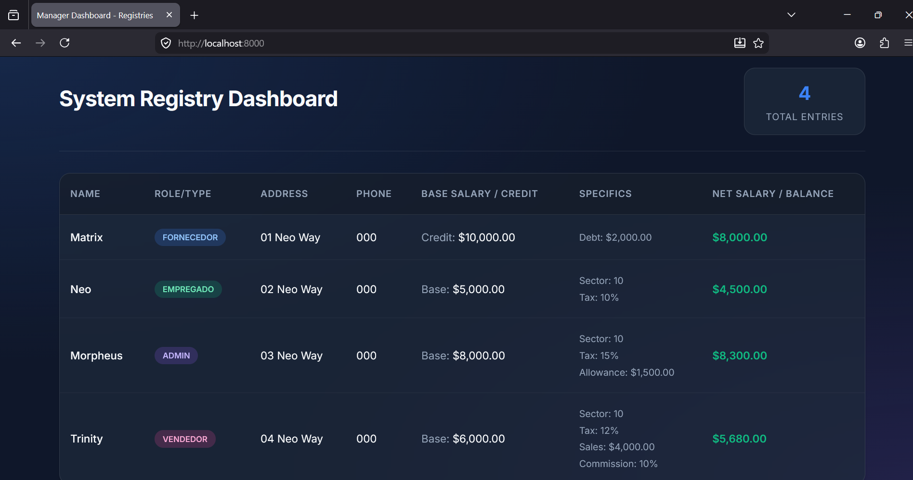
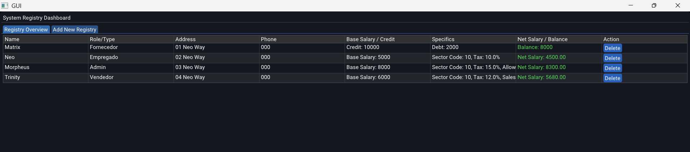

# GUI

A graphical application with a local sqlite database connecting to a web dashboard.

## Web Dashboard



### Setup
1. Download a Thread Safe version of PHP from [windows.php.net](https://windows.php.net/download/).
2. Extract it and rename `php.ini-development` to `php.ini`.
3. Edit `php.ini` and remove the `;` before `extension_dir = "ext"`, `extension=pdo_sqlite`, and `extension=sqlite3`.
4. Add the PHP folder to your system PATH.

Run GUI.exe

```bash
# start the dashboard from the folder root
php -S localhost:8000 -t dashboard
```
Navigate to `http://localhost:8000` in the web browser.

## ImGUI Application

A standard graphical application with a local sqlite database to add and delete registries. 



### Download

[GUI.exe](https://github.com/weslleyskah/database_gui/releases/)

### Build

> Need CMAKE and [Vulkan](https://vulkan.lunarg.com/sdk/home#windows) to build

- Run `scripts/build.bat` to generate the `build`

- Run `.../build/Debug/GUI.exe`

- Open the `.../build/GUI.slnx`, set `GUI.sln` as startup project, and run the code on Visual Studio

### Dependencies

> CMAKE, [Vulkan](https://vulkan.lunarg.com/sdk/home#windows), [ImGui](https://github.com/ocornut/imgui), GLFW, GLM, [Eigen](https://libeigen.gitlab.io/), sqlite

### Structure

| Folder | Description |
| :--- | :--- |
| `src/` | application |
| `dashboard/` | web dashboard |
| `dependencies/` | dependencies |
| `scripts/` | build |
