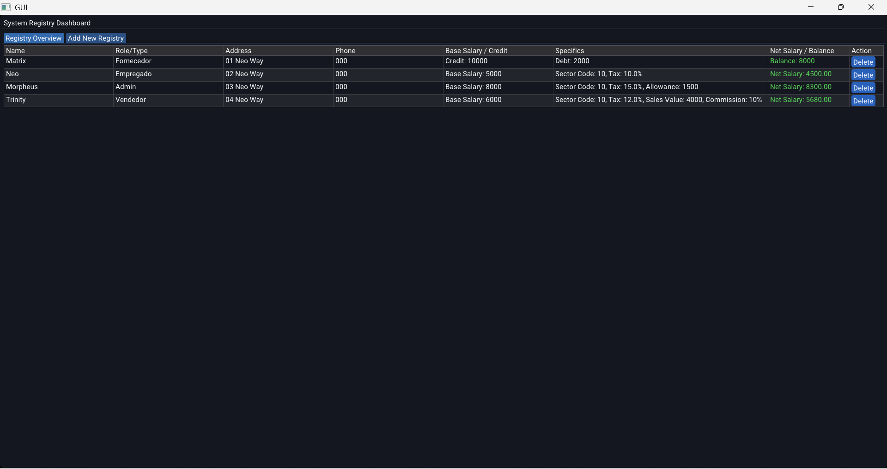

# GUI

A standard graphical application with a local sqlite database to add and delete registries. 

### Download

[GUI.exe](https://github.com/weslleyskah/database_gui/releases/)

### Build

> Need CMAKE and [Vulkan](https://vulkan.lunarg.com/sdk/home#windows) to build

- Run `scripts/build.bat` to generate the `build`

- Run `.../build/Debug/GUI.exe`

- Open the `.../build/GUI.slnx`, set `GUI.sln` as startup project, and run the code on Visual Studio

### Dependencies

> CMAKE, [Vulkan](https://vulkan.lunarg.com/sdk/home#windows), [ImGui](https://github.com/ocornut/imgui), GLFW, GLM, [Eigen](https://libeigen.gitlab.io/), sqlite

### Structure

| Folder | Description |
| :--- | :--- |
| `src/` | application |
| `dependencies/` | dependencies |
| `scripts/` | build |
